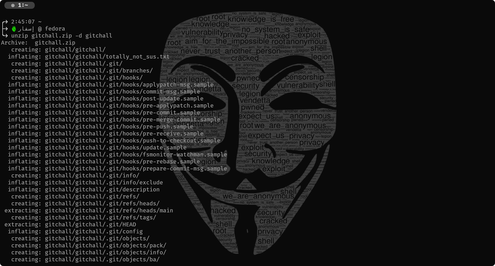
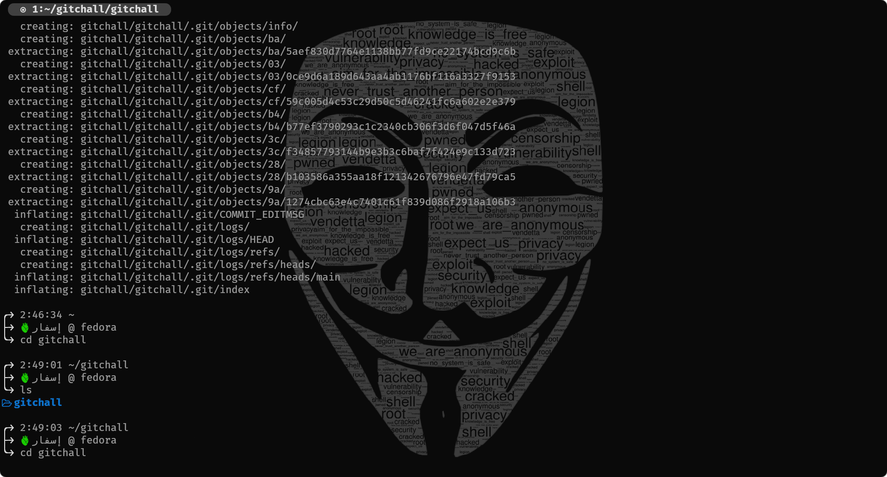
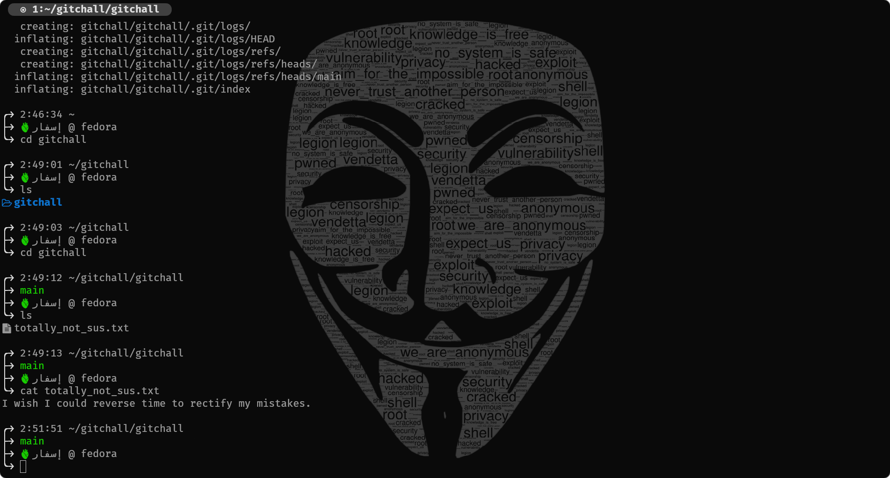
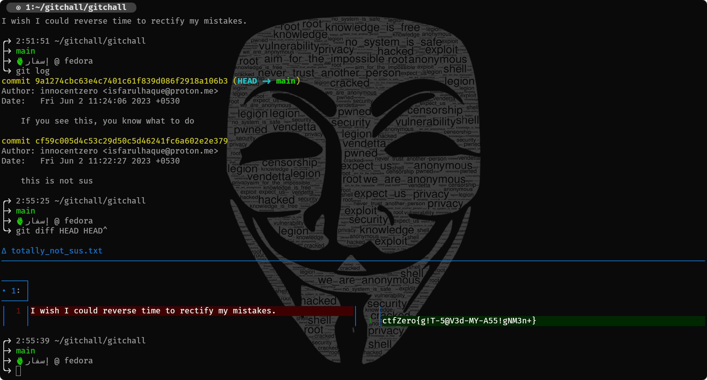

# I'm committed, or am I?

The included zip folder is actually a git repository. Git is a popular version control system. Read more about it [here](https://git-scm.com/book/en/v2). Windows users can download git from [here](https://git-scm.com/download/win). Nearly all standard Linux distributions have git preinstalled.

The following steps are for accessing the contents from the terminal (these are steps for linux, you can find equivalent commands for windows as well). 

1. Open the directory in which the zipped folder is downloaded.
 
2. Navigate to the folder.
 
3. On reading the contents of the file, we find that the user wants to get an older version of the file.
4. Since the challenge name has commit, and the folder name is gitchall, he is obviously referring to the git commits of the repository.
 
5. On checking for the changes in the files between the two commits, we find the flag. 
 

